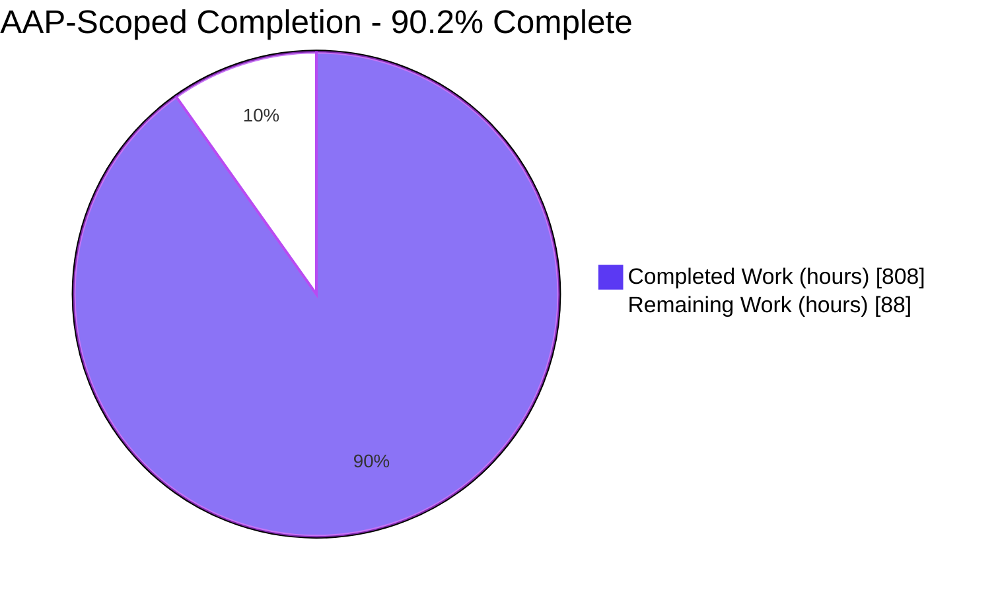
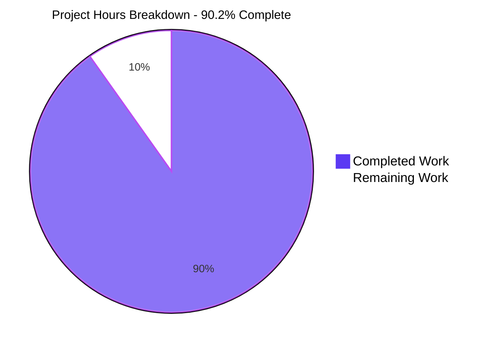
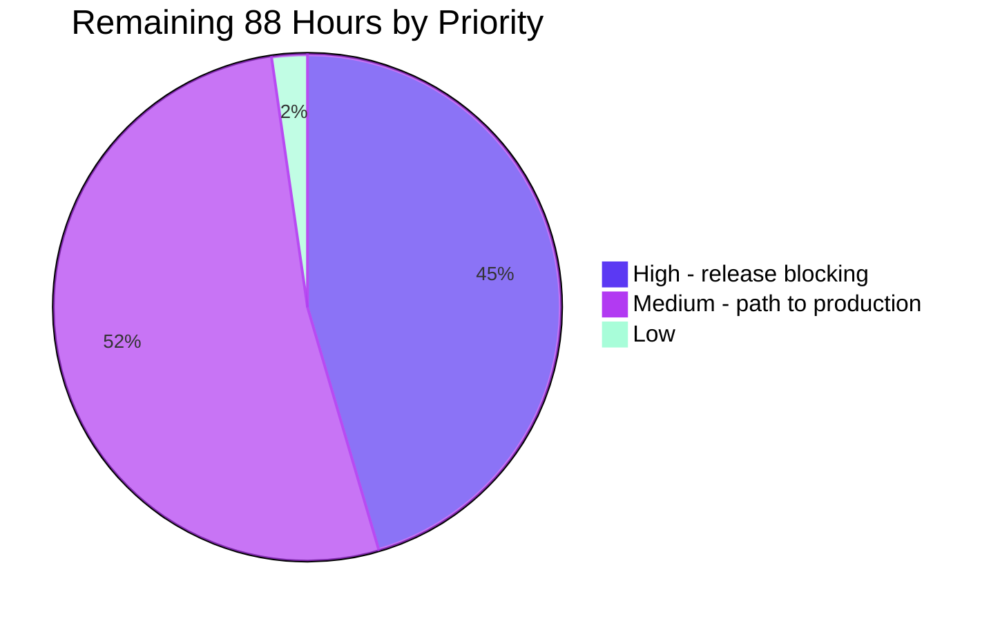
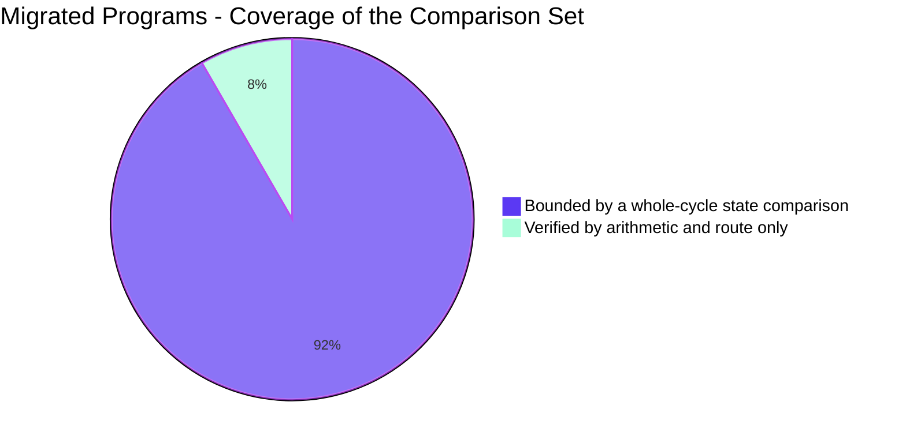

# 1. Executive Summary

## 1.1 Project Overview

The ACAS batch posting cycle — carrying entered transaction batches through validation, batch-control checking, posting to the Sales, Purchase, General and IRS ledgers, and period-total updates — now exists as a headless Python 3.12 package beside the original GnuCOBOL implementation, which remains untouched and serves as both specification and comparison oracle. Twelve programs, seventeen file handlers, twenty bridge mappings and twenty-two tables are reproduced behaviourally rather than improved: monetary values are computed in exact decimal against the receiving field's picture clause, posting order is preserved, and twenty-two legacy defects are reproduced deliberately. Its users are the operators and maintainers of a ledger that must post identical figures after the migration.

## 1.2 Completion Status



Completed = Dark Blue `#5B39F3`; Remaining = White `#FFFFFF`.

| Metric | Value |
|---|---|
| **Total Hours** | **896** |
| **Completed Hours (AI + Manual)** | **808** (808 autonomous, 0 manual) |
| **Remaining Hours** | **88** |
| **Percent Complete** | **90.2%** |

Calculation: `808 / (808 + 88) × 100 = 90.2%`. The denominator holds only work the Agent Action Plan scopes plus the path-to-production activities needed to deploy it. Every named deliverable exists at full size and passes its own suite; what remains is one acceptance criterion that cannot be evaluated here, its two dependents, two coverage gaps and four deployment activities.

## 1.3 Key Accomplishments

- ✅ **Exact-decimal COBOL semantics** — picture clauses, six storage classes, truncate-by-default arithmetic with five rounded sites, stable sorting; no binary floating point.
- ✅ **All twelve posting programs migrated**, preserving posting order, control totals and all five rejection classes.
- ✅ **Twenty-two-table data-access layer** reproducing the handler-and-bridge chain, cursor positioning and the file-status protocol over the unmodified schema.
- ✅ **1,365 tests pass, zero failures** — 1,251 arithmetic nodes plus 114 state-comparison and determinism nodes.
- ✅ **A 1,067-entry data dictionary** across 22 tables and 20 bridges, regenerating byte-identically, cited by every record field.
- ✅ **A ten-stage comparison harness** driving both implementations from identical seeds and enforcing evidence provenance.
- ✅ **Twenty-two legacy defects reproduced, not repaired**, fourteen locked by tests that fail if corrected.
- ✅ **The frozen specification untouched** — zero modifications on any COBOL, copybook, bridge or schema path.

## 1.4 Critical Unresolved Issues

| Issue | Impact | Owner | ETA |
|---|---|---|---|
| The compiled oracle cannot be built from unmodified frozen sources: `copybooks/ACAS-SQLstate-error-list.cob` is absent while 44 frozen files `COPY` it, so the build stops with 22 fatal diagnostics | The project's headline acceptance criterion cannot be evaluated. All state-comparison evidence is drawn from a disclosed transformed oracle and claims no parity | ACAS maintainer / project owner | 24h after the member is supplied |
| The mandated autocommit-off seeding window leaves every target table empty, so the durability gate refuses the seed | No conformant seed, therefore no conformant evidence — independently of the oracle question | Project owner (authorisation) or maintainer (committing loaders) | 8h |
| End-of-period processing (`acas_posting/programs/gl080_end_of_cycle.py`) has no ordering-normalised state comparison | Its arithmetic and its route are verified; its net database effect is not bounded by a diff | Engineering, after a scope decision | 12h |
| The disk-change archiving journey is unreachable without an authentic archive-flag fixture | The individual prompts are measured and unit-tested; the journey itself is never driven | Maintainer (fixture) + engineering | included above |
| Container-image vulnerability applicability is unadjudicated | Patch level at the pinned snapshot is provable offline; advisory applicability is not | Platform / security | 6h |
| `harness/scenarios/clean_batch_pl.yaml` seeds two open items whose invoice numbers collide with the purchase-invoice range | One open-item build step is unobserved on that scenario; state parity is unaffected | Engineering | 4h |

## 1.5 Access Issues

| System/Resource | Type of Access | Issue Description | Resolution Status | Owner |
|---|---|---|---|---|
| `copybooks/ACAS-SQLstate-error-list.cob` | Source artifact | Referenced by 44 frozen files but present in no reachable source — not this repository, not the vendored translator archive, not either vendored connector archive. It carries the SQL-state-to-file-status mapping that defines rejection behaviour, so it cannot be inferred | **UNRESOLVED** — must be supplied unmodified by the maintainer or authoritative upstream | ACAS maintainer |
| Vulnerability advisory data and a scanner | Tooling / network | No scanner is a project dependency and none is reachable, so advisory applicability for the two harness images cannot be closed offline | **UNRESOLVED** — run a pinned scanner in an environment that has one | Platform / security |
| Database connection credentials | Service credentials | Six connection variables plus a per-invocation administrative pair are required, with no committed defaults; the compose configuration refuses to render and names any variable that is missing | **RESOLVED** for the comparison harness; needs provisioning per environment | Operations |

## 1.6 Recommended Next Steps

1. **[High]** Obtain the missing frozen copybook member from the ACAS maintainer and place it unmodified in `copybooks/`; everything evidentiary is downstream of it.
2. **[High]** Rebuild the oracle from unmodified frozen sources, drive the eight ten-stage protocols, and adjudicate any non-empty diff.
3. **[High]** Settle the seeding authorisation in writing before presenting evidence as plan-conformant.
4. **[Medium]** Bound end-of-period processing with a state diff and obtain an authentic archiving fixture.
5. **[Medium]** Adjudicate image vulnerability applicability, then write the deployment runbook and record the cutover sign-off.

# 2. Project Hours Breakdown

## 2.1 Completed Work Detail

| Component | Hours | Description |
|---|---:|---|
| COBOL-semantics runtime (`acas_posting/cobol/`) | 56 | Picture parser and field descriptor, six numeric storage classes including the leading-sign display form, truncate-by-default arithmetic with exactly five rounded sites, `MOVE` truncation and padding, condition-name predicates, stable sort. 8 modules, ~10.1k lines, no business logic |
| Record layouts (`acas_posting/records/`) | 36 | 27 field-for-field dataclass modules covering every in-scope copybook; all 976 attributes route to a data-dictionary entry; source oddities preserved rather than corrected |
| Data dictionary generator and artifacts (`acas_posting/dictionary/`, `data_dictionary/`) | 32 | Derives the copybook ↔ host-variable ↔ column triple from the bridge sources and the schema; emits and validates 1,067 entries across 22 tables and 20 bridges; regenerates byte-identically |
| Data-access layer (`acas_posting/dal/`) | 120 | 17 handler modules mirroring the COBOL handler boundary, a dual-alias facade publishing 327 verb names, connection ownership reproducing the frozen bridges, file-status protocol, ISAM cursor emulation, and bridge sign/width drift reproduced field by field. ~69.3k lines |
| Twelve migrated program modules (`acas_posting/programs/`) | 160 | The posting cycle itself: batch check and the three-leg double-entry explosion, nominal-key sort, nominal-ledger update, transaction deletion and end-of-period, the control-total gate, sales and purchase invoice/cash/order/payment posting with the IRS fan-out, and IRS nominal posting. ~24.2k lines |
| CLI entry points, linkage binding and router (`acas_posting/cli/`, `__main__.py`) | 44 | Seven batch routes in the three distinct linkage shapes the frozen programs declare, menu-state load and persistence per subsystem, and a router mirroring the system-selection menu with all screen output removed |
| Controlled clock, date module, work files, package root | 32 | Pins both date observables at the boundary; full reimplementation of the date module including its non-standard epoch and its reject contract; the two General Ledger scratch files that carry data between stages of the cycle, as ordered in-process sequences |
| Arithmetic parity tier (`tests/arithmetic/`) | 72 | 14 files, one per computation pattern, with expected values captured from a compiled run rather than derived by reading the source, plus the locks that hold the reproduced defects in place |
| State-comparison and determinism tiers (`tests/scenarios/`, `tests/determinism/`, `tests/conftest.py`) | 48 | Eight scenario suites, the byte-identity proof, and shared fixtures that compose the ten-stage protocol with non-vacuity, seed-fingerprint and declared-status guards |
| Oracle comparison harness (`harness/`) | 104 | Five-step bootstrap including the recovered build rule for the bridge's C interface object, two digest-pinned container images, seeding that reproduces the loader contract with a durability gate, schema reset, two scenario drivers, and the dump/normalise/diff chain with an enforced provenance record |
| Traceability document | 24 | Program-to-module, paragraph-to-function with every control transfer classified, and a mechanically rendered enumeration of all 1,067 field entries |
| Anomaly register | 16 | All 22 reproduced legacy defects with locators, reproducing modules and a four-relationship lock map |
| Ambiguity-resolution register | 20 | Every semantic question arbitrated against observed compiled behaviour, with the experiment and its result recorded |
| Scenario diff-evidence register | 12 | Per-scenario capture manifests, digests and row totals, leading with the acceptance verdict |
| Operator guide (`README-python-migration.md`) | 20 | Build, seed, run, compare and troubleshoot, cross-referencing the maintainer's own documentation without amending it |
| Dependency manifests and packaging boundary | 12 | Exact hash-pinned dependency closure and a package allow-list that keeps the oracle out of the shipped artifact |
| **Total** | **808** | |

## 2.2 Remaining Work Detail

| Category | Hours | Priority |
|---|---:|---|
| Frozen-oracle build, eight-scenario state-comparison evidence and re-attestation of the register | 24 | High |
| Seeding authorisation decision and its written record | 8 | High |
| Re-confirmation of the oracle-arbitrated ambiguities against a frozen build | 8 | High |
| End-of-period state-diff coverage and an authentic archiving fixture | 12 | Medium |
| Purchase-scenario fixture collision and its re-attested run | 4 | Medium |
| Container-image vulnerability adjudication with a pinned scanner | 6 | Medium |
| Credential and secret operations for a non-harness environment | 8 | Medium |
| Deployment runbook, build/publish decision and release sign-off | 16 | Medium |
| Dependency-declaration decision and documentation hygiene | 2 | Low |
| **Total** | **88** | |

## 2.3 Hours Reconciliation

| Line | Hours |
|---|---:|
| Section 2.1 — completed | 808 |
| Section 2.2 — remaining | 88 |
| **Total project hours** | **896** |
| **Completion** | **808 / 896 = 90.2%** |

Completed hours are attributed entirely to autonomous work: the branch is purely additive — 53 commits, 143 files, 374,995 inserted lines and nothing removed — and no part of the Python tree predates this migration, since the repository contained no Python at all before it. The per-component figures are anchored to measured size and complexity rather than to line count alone: two of the largest areas are generated or table-driven (the dictionary artifact is ~82.5k generated lines and the test corpus ~80.2k lines of vectors), so the hand-authored surface that carries the estimate is the data-access, program, CLI, semantics and record layers.

# 3. Test Results

Every figure below was observed by executing the suite on this repository. The whole corpus is **1,365 nodes with zero failures**: 1,251 exact-arithmetic nodes that need no infrastructure, and 114 state-comparison and determinism nodes that need the container stack. Coverage is line coverage measured over `acas_posting` while running the arithmetic tier.

| Area / Category | Framework | Tests | Passed | Failed | Coverage | What This Proves |
|---|---|---:|---:|---:|---|---|
| Exact-decimal COBOL semantics — picture clauses, six storage classes, truncation, the five rounded sites, `MOVE`, stable sort | pytest 9.1.1 | 1,251 | 1,251 | 0 | 81.6% (`cobol/`) | Every monetary and quantity value is stored with the digits, scale, sign and truncation direction of the field that receives it |
| Record layouts and field-descriptor routing | pytest | *(within the 1,251)* | — | 0 | 96.6% (`records/`) | All 976 record attributes resolve to a data-dictionary entry, so no field metadata was transcribed by eye |
| Data dictionary generation and schema validation | pytest | *(within the 1,251)* | — | 0 | 92.1% (`dictionary/`) | The 1,067-entry dictionary regenerates byte-identically from the bridge sources and satisfies its own schema |
| Reproduced-defect locks (14 of the 22 register entries) | pytest | *(within the 1,251)* | — | 0 | — | A future "fix" to any of the fourteen locked legacy behaviours turns the suite red instead of passing unnoticed |
| Whole-cycle state comparison — clean batch per ledger, mixed accepted/rejected, period-end totals, control-total rejection, empty batch | pytest + ten-stage harness | 106 | 106 | 0 | *(out-of-process)* | For all eight scenarios the two implementations leave the 22 in-scope tables in an identical ordering-normalised state, 0 rows differing, 0-byte diff |
| Determinism | pytest + harness | 8 | 8 | 0 | *(out-of-process)* | Two runs under the same pinned clock produce byte-identical table dumps, so a scenario is repeatable |
| Whole corpus, bare host (no database, no container, no COBOL) | pytest | 1,365 | 1,292 | 0 | 48% overall | The arithmetic guarantee stands on a plain workstation; the 73 skips name the absent stack rather than failing |
| Whole corpus, inside the container stack | pytest | 1,365 | 1,365 | 0 | 48% overall | Nothing is skipped when the stack is present — every tier runs and passes |

Overall coverage of 48% is structural rather than a gap: the scenario tier drives the command-line routes as **subprocesses**, so their execution never accumulates into the measuring process. The layers a coverage number can meaningfully describe read 96.6% (records), 92.1% (dictionary), 81.6% (semantics), 67.6% (CLI), 50.4% (programs) and 33.9% (data access).

### Not Covered

These capabilities are delivered but are not exercised by any test, and a human should exercise each before release:

- **End-of-period processing** — its arithmetic is covered and its route was driven, but no ordering-normalised state comparison bounds its net database effect. The mandated scenario set contains no end-of-period case.
- **The disk-change archiving journey** — the individual prompts are measured against a compiled probe and unit-tested, but the section is reached only when the system record's archive flag is set, and no authoritative fixture sets it.
- **The frozen-source oracle build path** — cannot execute at all while the referenced copybook member is absent, so the 22 generated bridges are never compiled from unmodified sources.
- **A durable seed under the mandated transaction window** — the refusal is tested; a successful seed under that window cannot exist while no frozen loader commits.
- **One open-item build step in the purchase scenario** — masked by a seeded invoice-number collision.
- **The transfer-file rewrite verb's success path** — cannot exist by design, because the frozen handler rejects that verb unconditionally; the guard is asserted instead.
- **Prose in the operator guide and the four registers** — their counts, links, locators, anchors and status consistency are machine-checked, but the explanatory text is not executable.
- **Defence-in-depth branches** that the shipped configuration cannot reach: the database image's host-pattern opt-out and unset-variable arms, the privilege-drop shim's group-only form, and three fall-back arms in the seeding and reset scripts.

# 4. Runtime Validation &amp; UI Verification

Every line below records what was observed when the code was actually driven — against a live MariaDB 10.11.7 serving the unmodified 33-table schema, with the run date pinned. **There is no user interface to verify**: the target is a set of headless batch entry points and the original curses presentation layer was removed rather than reimplemented, so there is no browser surface, no HTTP listener and no screen to capture. All evidence is exit statuses, database state before and after, statement counters and published comparison verdicts.

- ✅ **Start-up and routing** — the router and all seven routes answer for themselves; every unknown or absent selection is refused with status 2 and no output on standard error. Stock and system setup are refused by name, as out-of-scope subsystems.
- ✅ **General Ledger posting cycle** (`general post-cycle`) — completes with status 0, running batch check, transaction pre-process and transaction update in that order, with the sort between them.
- ✅ **General Ledger abort gate** — an open batch raises the terminate code and the cycle stops: status **exactly 5**, with zero dispatches of the sort or the update stage. The database effect is the absence of everything the later stages would have written.
- ✅ **General Ledger end of cycle** (`general end-of-cycle`) — completes with status 0 across transaction deletion and end-of-period, producing five state deltas; the non-archiving and archiving forms behave distinctly and the archiving refusal leaves state unchanged.
- ✅ **Sales and purchase posting** (`sales invoice-post`, `sales cash-post`, `purchase order-post`, `purchase payment-post`) — each completes with status 0 and the expected read/insert/update counts; invoice posting grows open items from 2 to 4, writes a General Ledger posting and moves the sales-invoices period total by a penny-exact 1,498.74; all four are additionally bounded by their scenario comparisons.
- ✅ **IRS nominal posting** (`irs post`) — status 0; posting rows grow from 1 to 6, the nominal debit and credit accumulators and the VAT control account update as specified, and the end-of-job transfer-file clear is a measured no-op that issues no delete.
- ✅ **Controlled clock** — the pinned run date is read back **from the database** after every run, and five malformed dates each reproduce the frozen disposition exactly, with no value injected.
- ✅ **Comparison protocol** — all eight scenarios complete all ten stages and publish a machine-readable verdict of `identical`, 22 tables compared, 0 differing, with a zero-byte diff. Every verdict also records that the oracle it compared against was built from transformed sources, so none of them asserts parity with the frozen specification.
- ⚠ **Evidence gate and seeding gate** — both fail closed and were driven to prove it: the reset refuses an unattested or transformed oracle with status **77**, issuing **zero** `DROP TABLE` statements and leaving the schema untouched, and the seed refuses a non-durable window with status **76**. A connection failure is equally clean: an unreachable server ends the route with status 8 in one second and no traceback.
- ❌ **Frozen-source oracle build** — never runs to completion. The default build stops at status **74** with 22 fatal diagnostics because a referenced copybook member is absent from the frozen tree, so no run against the frozen specification has ever taken place.

# 5. Compliance &amp; Quality Review

## 5.1 Compliance Matrix

Each row shows where the deliverable stands now, against the benchmark the Agent Action Plan sets for it.

| Deliverable / Benchmark | Status | Progress | Verified By |
|---|---|---|---|
| Twelve posting programs migrated, including the two partial boundaries | ✅ PASS | 12 / 12 | `acas_posting/programs/` — every module present and driven, either by its route or by its scenario |
| Exact-decimal semantics: truncation by default, exactly five rounded sites, no binary floating point (R-2) | ✅ PASS | 100% (5 / 5 rounded) | Zero float literals and zero `numpy`/`pandas` use in the package — the only float references are rejection gates; exactly five `rounded=True` sites, mapping one-to-one to the plan's five; 1,251 arithmetic nodes pass |
| Data-access boundary over the unmodified schema, no ORM entity layer | ✅ PASS | 22 / 22 tables | 17 handler modules plus a 327-name dual-alias facade; data-manipulation statements only, zero schema statements |
| No COBOL at runtime (R-1) | ✅ PASS | 100% | Zero `subprocess`, foreign-function, or harness imports in the package; the built wheel carries 95 members and no COBOL, harness, test or SQL member |
| No new validations, fields, schema changes or concurrency (R-3) | ✅ PASS | 100% | Zero schema statements; zero concurrency primitives; the schema digest is unchanged and still declares 33 tables |
| Legacy defects reproduced, never repaired (R-4) | ✅ PASS | 22 / 22 | The register carries entries A-1 … A-22 with locators and reproducing modules; 14 are held by a test that fails on a "fix" |
| Full traceability and a machine-readable dictionary derived from the bridge (R-5) | ✅ PASS | 1,067 / 1,067 fields | Program → module, paragraph → function with every control transfer classified, and field → entry for all 1,067 entries across 22 tables and 20 bridges; the dictionary regenerates unchanged and validates against its committed schema |
| Frozen artifacts unmodified | ✅ PASS | 0 changes | No file changed under any COBOL, copybook, bridge, schema or maintainer-document path across the whole branch |
| Controlled clock and determinism | ✅ PASS | 100% | Both date observables pinned at the boundary; two runs produce byte-identical dumps; the pinned date reads back from the database |
| Mandated scenario set covered, ten-stage protocol operable | ✅ PASS | 8 / 8 | All eight scenarios complete all ten stages and publish an `identical` verdict over 22 tables |
| **State parity against the frozen compiled specification (R-6, the headline criterion)** | ❌ **FAIL** | **0 / 8** | The frozen build cannot complete; every verdict records that its oracle was built from transformed sources and claims no parity |
| Seeding under the mandated transaction window | ❌ **FAIL** | 0 / 8 | The window persists nothing and the durability gate refuses it; every fixture uses a declared deviation |

## 5.2 AAP &amp; Rule Divergences and Gaps

| What the AAP/Rule Required | What Was Delivered Instead | Why It Diverged | Impact | Remediation |
|---|---|---|---|---|
| §0.8.5 criterion 1 — an empty ordering-normalised diff per scenario against the **frozen** compiled oracle | Empty 22-table diffs against a disclosed **transformed diagnostic** oracle, every verdict stamped as making no parity claim, and the acceptance state recorded as not met | A frozen copybook member that 44 frozen files reference is absent, and §0.8.1 forbids this migration writing anything into `copybooks/` even from an authentic copy | The headline acceptance criterion is unmet. Nothing overstates it: the tooling refuses at build and reset rather than claiming success | Maintainer supplies the member; rebuild frozen and re-run the eight protocols (Section 2.2, 24h) |
| §0.2.1.1 / §0.4.1.7 / §0.5.2 — seed through the maintainer's loaders with autocommit **off** | The mandated window remains the shipped default and provably persists nothing; every usable fixture is seeded under an explicitly requested deviation | No frozen loader reaches a live `COMMIT` and the vendored C interface exposes no autocommit call, so the plan's own premise does not hold of the frozen source. Supplying the missing commit is precisely what R-4 forbids | No conformant seed, so no conformant evidence, independently of the oracle | A written decision: committing loaders, or authorisation of the deviation (Section 2.2, 8h) |
| §0.5.1 / §0.3.3 — SQLAlchemy 2.0.51 "used at Core level only" | SQLAlchemy and its transitive dependency are pinned and hash-locked in both manifests but imported nowhere; the connector is used directly | §0.8.2 states the requirement as either/or, and the data-access layer must reproduce the frozen bridges' connection ownership, which an engine that owns lifecycle cannot do | Two pinned packages ship unused. No behavioural effect | Confirm the either/or reading, or drop the two pins (Section 2.2, 2h) |
| §0.8.5 — the mandated scenario set is exactly eight | Exactly eight ship, which leaves end-of-period processing without a state-diff bound | A ninth definition was built and then withdrawn to keep the tree at the plan's fixed inventory; merging its assertions into an existing scenario was measured to be behaviourally impossible | End-of-period arithmetic and route are verified; its net database effect is not | A scope decision, then a ninth scenario plus a fixture whose posting walk is not starved (Section 2.2, 12h) |
| §0.3.1 — the dictionary sits at the `data_dictionary/` sibling | It does, as the single committed artifact; the built wheel *additionally* carries a byte-identical copy inside the package | Without it, an installed distribution cannot resolve the dictionary at all and every route fails at import | None on the specification: one committed artifact, one committed path | None required |
| §0.4.3 — the arithmetic tier may import `cobol` and `records` | It also imports `dictionary` at module scope and reaches the data-access, program and CLI layers inside test bodies | `dictionary` is the layer beneath `cobol`, so it is a reach down; the reaches into shipped code exist because R-4 requires defect locks to assert against the code that ships | None. The tier still needs no database, COBOL or container, and a static guard enforces that | None required |
| §0.3.1 — the file inventory names 141 paths | The tree carries 143: two repository-hygiene files were added | Removing them would return build and coverage artifacts to version control and break the container image build | None. Both are disclosed in the traceability document | None required |
| R-3 — no schema changes | The database image administers server **accounts** (revoke, grant, create user) to reduce the application account to four data-manipulation verbs | R-3 freezes the schema, not the server's account list; account administration is invisible to any table dump or state diff | None. Zero schema statements are emitted and the schema digest tripwire passes | None required |

**Frozen-oracle state parity.** This divergence governs the release. The plan's definition of exact is operational: seed identically, run the compiled cycle, dump, reset, run the Python cycle, dump, and the diff must be empty. That protocol runs and returns an empty 22-table diff for all eight scenarios — but its oracle was compiled from 41 transformed source paths, because the frozen sources do not compile: `copybooks/ACAS-SQLstate-error-list.cob` is absent while 22 bridges and their 22 sources `COPY` it, so `harness/build_oracle.sh` stops at 74. The gap is enforced rather than hidden: the reset refuses at 77 before touching a table, and every verdict records `oracle_source_is_frozen: no`. The two implementations agree; neither is yet shown to reproduce the specification.

**Seeding under the mandated window.** The plan mandates autocommit off during seeding, on the strength of an operator banner in one loader. That mandate ships as the default — and under it seven loaders return success while all seven target tables read zero rows, so the durability gate stops at 76 rather than letting an empty state pass as a fixture. The cause is entirely frozen code: no `common/*LD.cbl` loader reaches a live `COMMIT` (the only one is commented out, at `common/irsdfltLD.cbl:L437`) and the vendored C interface exposes no autocommit entry point. Issuing the missing commit is the repair R-4 forbids. One decision closes it: committing loaders, or written authorisation.

**The declared but unused database library.** The plan pins SQLAlchemy at Core level as one of two permitted access routes; the pin is present and hash-locked in both manifests, but nothing imports it. `acas_posting/dal/connection.py` uses the connector directly because it must reproduce how the frozen bridges own a connection: one named connection re-opened in place, shared process-wide, with a single handler opting out. An engine that owns connection lifecycle cannot express that without changing reproduced behaviour, which R-4 forbids. Because §0.8.2 states the requirement as either/or the delivered choice is licensed — but two pinned dependencies ship untouched. Confirm the reading, or drop the pins.

**End-of-period without a state-diff bound.** The plan fixes the scenario set at eight, and none is an end-of-period case. End-of-period processing is nonetheless one of the twelve migrated programs and owns one of the five rounded sites, so its absence from the comparison set is a real gap: the rounded cycle divide, the unbounded quarter subscript, the second rotating counter and the archive sign flips are each covered by arithmetic tests and the module was driven through its route, but no ordering-normalised diff bounds what it leaves in the tables. Folding its assertions into an existing scenario proved impossible — in both candidate fixtures the posting walk is starved, so the assertions would pass while proving nothing.

**The wheel's dictionary copy.** The plan places the generated dictionary at the `data_dictionary/` sibling, and that is where the single committed artifact lives. The built distribution additionally carries a byte-identical copy inside the package, because without it the first record dataclass to ask for its field descriptor raises at import time, so an installed wheel could print help and do nothing else. The committed artifact remains the authority and the packaged copy is produced at build time from it; both were compared byte for byte, and a real posting run from an installed wheel produced 22-table fingerprints identical to the same run from the repository. Nothing to do.

**The arithmetic tier's import reach.** The plan's layering table permits the arithmetic tier `cobol` and `records`. It also imports `dictionary` at module scope — the layer directly beneath `cobol`, so a reach downwards — and reaches the data-access, program and CLI layers inside individual test bodies. That second reach is required by R-4: a lock that is supposed to stop someone repairing a legacy defect has to assert against the module that actually ships, not against a copy of the primitive. The tier's defining property is preserved and enforced by a static guard: it needs no database, no COBOL and no container, which is why 1,251 nodes run on a plain workstation. Nothing to do.

**Two hygiene files beyond the inventory.** The plan's file inventory names 141 paths; the tree carries 143, the extra two being `.gitignore` and `.dockerignore`. They are deliberate and disclosed in the traceability document. Removing them would put generated build, wheel and coverage artifacts back into version control — where a stale duplicate of a source file is a genuine hazard when reading this codebase — and would break the container image build, whose context filter depends on them. They contain no logic and affect no behaviour. Nothing to do.

**Account administration under a schema freeze.** R-3 forbids schema changes, and none are made: the frozen dump's 33 tables are applied verbatim, its digest tripwire passes, and the delivered code emits no schema statement of any kind. The database image nonetheless issues account-level statements at initialisation, to revoke everything from the application account and grant back only four data-manipulation verbs on one schema from one host pattern, refusing to initialise unless exactly those grants are held. R-3 freezes the schema, not the server's account list, and account administration is invisible to every table dump and state diff. The effect is strictly protective. Nothing to do.

# 6. Risk Assessment

Forward-looking exposure only: what could still go wrong from here, in production or during maintenance.

| Risk | Category | Severity | Probability | Mitigation | Status |
|---|---|---|---|---|---|
| Parity against the frozen compiled specification is unproven — agreement is established against a transformed diagnostic oracle, so the Python cycle may be reproducing a partly repaired variant rather than the shipped COBOL | Technical | High | Medium | The tooling refuses to claim otherwise: the build stops at 74, the reset refuses at 77, and all eight verdicts record that their oracle was not frozen. The transforms are enumerated in the build attestation and none touches the General Ledger programs or their copybooks, so residual exposure is bounded | OPEN — blocks release sign-off |
| The mandated seeding window cannot persist a seed, so every fixture depends on a declared deviation and any environment that seeds differently produces evidence that fails on the plan's own terms | Integration | High | High | The durability gate measures its own writes and stops at 76 rather than carrying an empty state forward; the deviation is recorded in each verdict by digest, never applied silently | OPEN — one written decision closes it |
| Reproduced legacy defects are load-bearing, so a well-intentioned future repair would be a regression that no downstream consumer could detect | Technical | Medium | Medium | All 22 anomalies carry a register entry with a source locator and a reproducing module, and 14 are held by a test that turns red the moment the behaviour is corrected | MITIGATED |
| Posting correctness depends on sort stability — the nominal account is located by a sequential read (`general/gl072.cbl:L408`), so a perturbed order posts to the wrong account with no error and no diagnostic | Technical | High | Low | `acas_posting/cobol/sortverb.py` guarantees stability by contract, and the sort program's four-key output ordering is asserted directly rather than left to be caught indirectly by a state diff | MITIGATED |
| End-of-period processing has no ordering-normalised state comparison, so its net database effect is unbounded — and its disk-change journey is unreachable without an authentic archiving fixture | Technical | Medium | Medium | Its rounded cycle divide, unbounded quarter subscript, second rotating counter and archive sign flips are each covered by arithmetic tests, and the module is driven through its route | OPEN |
| Vulnerability applicability for the two container images cannot be adjudicated offline, so an advisory affecting the toolchain could go unnoticed | Security | Medium | Medium | Both images are provably at their pinned package snapshot with zero pending upgrades and ship their own inventories (157 and 231 components); no scanner is a project dependency, by design | OPEN |
| Every evidence gate is invoked by hand, inside the container stack, with two mandatory flags and a per-invocation administrative credential pair — so a future change can land unverified | Operational | Medium | Medium | A run started without the flags skips with the exact remedy in its message rather than failing obscurely; the network is internal with no published port; the operator guide carries the exact commands. No automated pipeline exists, deliberately | PARTIALLY MITIGATED |
| Value drift at the record-to-table boundary, and dependence on one server and one driver configuration — a signed value narrows to an unsigned column and one name widens from 24 to 32 characters before any statement executes; a different server or a default converter would reintroduce binary floating point | Integration | Medium | Low | Every drift is reproduced field by field from the 1,067 dictionary entries rather than generalised, the dump normaliser canonicalises the padding it produces, the server is pinned to the version the frozen schema names as its producer, and the driver's numeric converters are pinned to exact decimal and integer types | MITIGATED |

Three lower-severity exposures are accepted rather than mitigated, because removing them would change reproduced behaviour or contradict the plan. Whole-result buffering is inherited from the legacy client call and makes memory grow linearly with result size — measured at 2.14 and 2.22 KiB per row across a sixty-fold range, agreeing within 4%, with no leak beyond that. Compiler builds are not byte-reproducible, so a module-set digest identifies a build event rather than a reproducible artifact. And the shared evidence volume lets a fixture rebuild invalidate an earlier session's fingerprint, which the comparison detects and refuses rather than reporting as a pass.

# 7. Visual Project Status

**Hours delivered against hours outstanding.** Completed work is Dark Blue (#5B39F3); remaining work is White (#FFFFFF).



**Remaining work by priority.** All 88 outstanding hours, grouped by the priority assigned in Section 2.2.



**Remaining hours per category.** The nine outstanding items from Section 2.2, largest first.

| Category | Hours | Share of the 88 |
|---|---|---|
| Frozen-source oracle build and eight-scenario parity evidence | 24 | ████████████ 27.3% |
| Deployment runbook, build/publish decision and release sign-off | 16 | ████████ 18.2% |
| End-of-period state-diff coverage and an authentic archive fixture | 12 | ██████ 13.6% |
| Conformant-seeding decision and record | 8 | ████ 9.1% |
| Re-confirming the arbitrations against a frozen build | 8 | ████ 9.1% |
| Credential and secret operations outside the harness | 8 | ████ 9.1% |
| Container image vulnerability adjudication | 6 | ███ 6.8% |
| Purchase-scenario fixture collision and re-attested run | 4 | ██ 4.5% |
| Dependency-declaration decision and documentation hygiene | 2 | █ 2.3% |
| **Total** | **88** | **100%** |

**Delivered capability, by verified state.** Every migrated capability is functionally complete and exercised; what separates the two bands is whether an ordering-normalised database comparison bounds it against the compiled specification.



# 8. Summary &amp; Recommendations

**What was delivered.** The ACAS batch posting cycle now exists as a headless Python 3.12 package alongside the COBOL it was migrated from, and the COBOL is untouched — no file changed under any program, copybook, bridge or schema path across the entire branch, and the schema's digest still matches the frozen dump's 33 tables. All twelve in-scope programs are present, including the two whose migration boundary is a single section rather than a whole file. Beneath them sit a COBOL-semantics runtime that models picture clauses, six numeric storage classes, truncation-by-default arithmetic with exactly five rounded exceptions, receiving-field `MOVE` rules and stable sorting; 27 record layouts generated field-for-field from a 1,067-entry data dictionary derived from the maintainer's bridge rather than from the copybooks; a data-access layer of 17 handler modules and a 327-name dual-alias facade issuing only data-manipulation statements against the unmodified schema; seven command-line routes across the three linkage shapes the COBOL call sites define; and the four mandated documents — dictionary, traceability, anomaly register and diff evidence. Measured against the plan's hour-weighted scope, the project is **90.2% complete: 808 of 896 hours**.

**What was verified.** 1,365 test nodes pass with zero failures. 1,251 of them run on a plain workstation with no database, no compiler and no container, and they are where exactness is established: per-field descriptors, packed and binary storage, leading-sign display, truncation versus rounding, both VAT formulations, the double-entry explosion, the control-total comparison including the order in which VAT enters it, ledger-balance accumulation and the bridge's derived date components. The remaining 114 drive the whole cycle: all eight mandated scenarios complete a ten-stage seed-run-dump-reset-run-dump-compare protocol and publish an `identical` verdict over 22 tables with zero differing rows, and two runs under the same pinned date produce byte-identical dumps. The six ordering dependencies that make this codebase fragile are held explicitly — the sort program's four-key output order is asserted directly, because a downstream sequential read makes it a correctness requirement rather than a detail — and 14 of the 22 reproduced legacy defects are locked by a test that fails if someone repairs them.

**What is not established, and it is one thing.** The plan defines success operationally: an empty diff against the *frozen* compiled program. That protocol runs, and it returns empty diffs — but the oracle it compares against was built from 41 transformed source paths, because the frozen sources do not compile: `copybooks/ACAS-SQLstate-error-list.cob` is absent while 22 generated bridges and their 22 sources reference it, so the build stops at status 74 and the reset refuses at 77 before touching a table. Supplying that member is forbidden to this migration, and the gap is disclosed rather than papered over — every verdict records that its oracle was not frozen and claims no parity. Independently, the mandated autocommit-off seeding window provably persists nothing, because no frozen loader reaches a live commit, so every fixture rests on an explicitly requested deviation. The two together mean the codebase is behaviourally consistent and thoroughly exercised, but not yet demonstrated to reproduce the specification it was written against. Everything else outstanding is ordinary path-to-production work: an end-of-period state comparison, one fixture key collision, vulnerability adjudication, credential operations, and a runbook.

**The critical path.** Four steps, in order. First, obtain the missing copybook member from the maintainer or authoritative upstream and place it unmodified in the frozen tree — the build prints its own four-step remedy when it fails, and nothing evidentiary can move before this. Second, rebuild the oracle with no waiver flags and drive the eight protocols again; the diffs either stay empty, in which case parity is established and the arbitrations re-confirm against a frozen build, or the differences that appear are the real work list. Third, settle the seeding question in writing — committing loaders from the maintainer, or authorisation of the deviation as an amendment — because until it is settled no evidence can be presented as conformant however clean it looks. Fourth, close the ordinary gaps: bound end-of-period with a diff, move the purchase fixture's colliding keys, adjudicate image advisories, and write the runbook and sign-off. That is 88 hours, 40 of them on the release-blocking path.

**Production readiness.** Not ready for cutover, and the reason is evidentiary rather than defective. Nothing is known to be wrong with the delivered code: it compiles, it runs, 1,365 nodes pass, it emits no schema statement, it carries no COBOL at runtime, it uses no binary floating point in any accounting path, it has no placeholder or stub, and it holds the frozen tree byte-for-byte intact. What is missing is the one proof this migration exists to produce. A reader can safely treat this as a complete implementation under review; they should not switch a live ledger onto it until the frozen comparison has run and the seeding authorisation is on the record. The most reassuring property of what was delivered is that it will not let anyone skip that step: three separate gates refuse — at build, at reset, and at every published verdict — rather than reporting a success they cannot substantiate.

# 9. Development Guide

Every command below was executed on this checkout and behaves as written. Two things run independently of each other: the **migrated package**, which needs only Python and a database, and the **comparison harness**, which needs Docker and is where the compiled COBOL lives. Nothing in the package requires a COBOL compiler.

## 9.1 System Prerequisites

| Requirement | Version | Needed for | Notes |
|---|---|---|---|
| CPython | **3.12.x** (3.12.13 verified) | The package and all tests | The manifest pins `requires-python == "3.12.*"`. Recent Ubuntu images ship only 3.13/3.14, so 3.12 must be supplied separately |
| C `_decimal` / libmpdec | 2.5.1 | Exact-decimal arithmetic | Verify with the check below. A pure-Python `decimal` fallback is not acceptable for this project |
| Docker Engine + Compose v2 | 29.7.0 verified | The comparison harness only | Overlay2 storage driver |
| MariaDB client | any current | Ad-hoc inspection | Optional |
| A running MariaDB/MySQL server | **10.11.7** | Running a posting route outside the harness | The version the frozen schema names as its producer |
| COBOL compiler | — | **Not required** | The package carries no COBOL and the harness tree is excluded from packaging |

Confirm the interpreter is the right one before anything else:

```bash
python3.12 --version
python3.12 -c "import decimal, _decimal; print(decimal.Decimal is _decimal.Decimal, _decimal.__libmpdec_version__)"
# expected: 3.12.x   and   True 2.5.1
```

If you are building 3.12 from source, these headers are what its optional modules need:

```bash
sudo DEBIAN_FRONTEND=noninteractive apt-get install -y build-essential pkg-config \
  libssl-dev zlib1g-dev libffi-dev libsqlite3-dev libbz2-dev liblzma-dev \
  libreadline-dev uuid-dev libgdbm-dev tk-dev wget xz-utils mariadb-client
```

## 9.2 Environment Setup and Dependency Installation

Run from the repository root. The manifest is hash-locked, so installation is reproducible and refuses anything unexpected.

```bash
python3.12 -m venv .venv
source .venv/bin/activate
pip install --require-hashes -r requirements.txt     # 13 pins, 70 hashes
pip install --no-build-isolation -e .
pip check                                             # expected: No broken requirements found.
```

- **Do not upgrade any pin.** Versions are chosen from repository evidence, not convenience.
- **Do not add** `pandas`, `numpy`, a migration tool, an ORM entity layer, a test-parallelism plugin, or a third-party date library. Each would breach a project rule: binary floating point in accounting code, schema evolution, or replacing the reproduced date semantics with something more correct than the specification.
- `.venv/` is ignored by version control and must stay that way.

Connection parameters are read from the environment. There are no committed defaults, deliberately:

```bash
export ACAS_DB_HOST=localhost ACAS_DB_PORT=3306 ACAS_DB_NAME=ACASDB
export ACAS_DB_USER=acas       ACAS_DB_PASSWORD='<supplied>'
# optional, all default to 300 seconds - every wait has a finite deadline
export ACAS_DB_CONNECT_TIMEOUT=300 ACAS_DB_READ_TIMEOUT=300 ACAS_DB_WRITE_TIMEOUT=300
```

Each credential must be **12 characters or fewer** — that is the carrier width of the frozen record the connection block is read from, and a longer value would be silently truncated by the COBOL side.

## 9.3 Running the Migrated Cycle

The router mirrors the subsystem menus, minus every screen. Seven operations are published across three linkage shapes:

```bash
python -m acas_posting --help

python -m acas_posting general  post-cycle      --help    # gl070 -> abort gate -> gl071 -> gl072
python -m acas_posting general  end-of-cycle    --help    # gl080
python -m acas_posting sales    invoice-post    --help    # sl055 -> sl060
python -m acas_posting sales    cash-post       --help    # sl100
python -m acas_posting purchase order-post      --help    # pl055 -> pl060
python -m acas_posting purchase payment-post    --help    # pl100
python -m acas_posting irs      post            --help    # irs030 - no run date, by design
```

A worked example that posts for real:

```bash
python -m acas_posting sales invoice-post \
  --run-date 21/09/2025 --date-form 1 --irs-instead ' '
# exit 0, terminate code 0, ten tables holding rows
```

Three behaviours are worth knowing before you drive it:

- **Destructive intent must be stated.** The cash and payment routes require `--ok-to-post` or `--no-ok-to-post`; the IRS route requires `--clear-posting-file` or `--no-clear-posting-file`; end-of-cycle requires `--disk-change-option`. Omit one and the route exits **2** without contacting the database. The COBOL default is the answer a human gave having read the question on screen, so an option nobody typed is not that answer.
- **Out-of-scope selections are refused by name.** `stock`, an unknown subsystem, and no argument at all each exit **2**.
- **The General Ledger abort gate is real.** An open batch in the cycle makes the run stop with exit **5** before the sort and the update — the frozen menu does exactly this, and the later stages must not run.

## 9.4 Verifying the Installation

```bash
# 1. Exactness, on a bare workstation - no database, no Docker, no COBOL
python -m pytest -m arithmetic
# expected: 1251 passed, 114 deselected

# 2. Everything runnable here; the skips name the absent container stack
python -m pytest
# expected: 1292 passed, 73 skipped

# 3. The data dictionary still regenerates unchanged from its three sources
python -m acas_posting.dictionary.generate --check
# expected: exit 0, "unchanged - 1067 entries ... across 22 tables and 20 bridges"

# 4. The frozen tree is untouched - this must always pass
git diff --quiet origin/main...HEAD -- \
  common copybooks general sales purchase irs stock mysql README.TXT Changelog \
  && echo "FROZEN OK" || echo "FROZEN VIOLATED"
# expected: FROZEN OK
```

## 9.5 The Comparison Harness

The harness builds the compiled COBOL and runs the ten-stage protocol against it. Credentials come from a file **outside** the repository; the Compose configuration will not render without them.

```bash
export CLONE_INDEX=001
export ACAS_DB_USER=acas ACAS_DB_PASSWORD='<supplied>'
export MARIADB_ROOT_PASSWORD='<supplied>'
export ACAS_DB_ADMIN_USER='<supplied>' ACAS_DB_ADMIN_PASSWORD='<supplied>'

docker compose -f harness/docker-compose.yml config -q   # exit 0, or exit 1 naming what is missing
docker compose -f harness/docker-compose.yml up -d       # mariadb reaches Healthy, gnucobol starts
```

The stack-bound tests must run **inside** the `gnucobol` service: the Compose network is `internal: true` with no published port, so the database is unreachable from the host by design.

```bash
docker compose -f harness/docker-compose.yml run --rm -T \
  -e ACAS_SEED_AUTOCOMMIT=on -e ACAS_ACCEPT_TRANSFORMED_ORACLE=1 \
  -e ACAS_DB_ADMIN_USER -e ACAS_DB_ADMIN_PASSWORD \
  gnucobol sh -lc 'cd /repo && python3 -m pytest -p no:cacheprovider -q -m "scenario or determinism"' \
  < /dev/null
# expected: 114 passed, 1251 deselected
```

Read the outcome of each scenario from its published verdict — `outcome`, `tables_compared`, `tables_differing`, and the field that states whether the oracle was built from unmodified frozen sources:

```bash
docker compose -f harness/docker-compose.yml run --rm -T gnucobol \
  sh -lc 'for v in /out/*/verdict.json; do echo "== $v"; grep -E "outcome|tables_|oracle_source_is_frozen" "$v"; done' \
  < /dev/null
```

Bring it down when finished:

```bash
docker compose -f harness/docker-compose.yml down
```

## 9.6 Troubleshooting

| Symptom | Cause | What to do |
|---|---|---|
| Oracle build exits **74** | `copybooks/ACAS-SQLstate-error-list.cob` is absent while 44 frozen files reference it, so the frozen build cannot compile | The failure prints a four-step remedy. Only the maintainer can supply the member; nothing in this project may write into `copybooks/` |
| Reset exits **77** | The evidence gate refuses an oracle that was not built from frozen sources. Verified: zero tables dropped, nothing touched | Pass `--accept-transformed-oracle` (or set `ACAS_ACCEPT_TRANSFORMED_ORACLE=1`, which the fixtures translate into the flag) only when a diagnostic run is what you want. Every verdict is then marked as claiming no parity |
| Seed exits **76** | The durability gate. Under the mandated autocommit-off window the loaders report success while their target tables read zero rows | Set `ACAS_SEED_AUTOCOMMIT=on` — the declared deviation. Never work around the gate itself; an empty fixture proves nothing |
| Build exits **65 / 66 / 67** | A precondition: a credential longer than twelve characters, credentials the server rejects, or a build tree that is neither empty nor marked | Fix the precondition named in the message and retry |
| A harness tool exits **80 / 83** | Mutually exclusive selection flags, or a table name outside the 22 in scope | Correct the invocation; the message names the conflict |
| A route exits **8** within a second | The connection contract is absent or the server is unreachable. Verified with a wrong port | Check the six connection variables and that the server is listening |
| A route exits **2** | An unstated destructive decision, or an unknown/out-of-scope selection | Supply the explicit flag, or pick a published operation |
| A route exits **5** | Not an error — the General Ledger abort gate fired on an open batch | Prove and close the batch first, exactly as the frozen cycle requires |
| Compose ignores `-e` | Every `-e` flag must precede the service name | Move the flags ahead of `gnucobol` |
| A container command hangs | It is waiting on a terminal | Pass `-T` and redirect stdin from `/dev/null` |
| `python: not found` in the container | The image publishes `python3` only | Use `python3` inside the image |
| pytest cannot write its cache in the container | `/repo` is mounted read-only | Add `-p no:cacheprovider` |
| A route starts and then fails at import | The record layer cannot resolve its field descriptors | Run from the repository or from an installed distribution. The loader's message names both candidate locations and four remedies |

# 10. Appendices

## A. Command Reference

| Purpose | Command |
|---|---|
| Create and enter the environment | `python3.12 -m venv .venv && source .venv/bin/activate` |
| Install pinned dependencies | `pip install --require-hashes -r requirements.txt` |
| Install the package for development | `pip install --no-build-isolation -e .` |
| Confirm the dependency set is coherent | `pip check` |
| List every published operation | `python -m acas_posting --help` |
| General Ledger posting cycle | `python -m acas_posting general post-cycle --run-date DD/MM/CCYY --date-form 1` |
| General Ledger end of cycle | `python -m acas_posting general end-of-cycle --run-date DD/MM/CCYY --disk-change-option N` |
| Sales invoice posting | `python -m acas_posting sales invoice-post --run-date DD/MM/CCYY --date-form 1` |
| Sales cash posting | `python -m acas_posting sales cash-post --run-date DD/MM/CCYY --ok-to-post` |
| Purchase order posting | `python -m acas_posting purchase order-post --run-date DD/MM/CCYY --date-form 1` |
| Purchase payment posting | `python -m acas_posting purchase payment-post --run-date DD/MM/CCYY --ok-to-post` |
| IRS nominal posting | `python -m acas_posting irs post --no-clear-posting-file` |
| Exactness tier (no database, no container) | `python -m pytest -m arithmetic` |
| Everything runnable on a bare host | `python -m pytest` |
| Confirm the dictionary regenerates unchanged | `python -m acas_posting.dictionary.generate --check` |
| Confirm the frozen tree is untouched | `git diff --quiet origin/main...HEAD -- common copybooks general sales purchase irs stock mysql README.TXT Changelog` |
| Validate the harness configuration | `docker compose -f harness/docker-compose.yml config -q` |
| Start the harness stack | `docker compose -f harness/docker-compose.yml up -d` |
| Whole-cycle and determinism tiers | `docker compose -f harness/docker-compose.yml run --rm -T -e ACAS_SEED_AUTOCOMMIT=on -e ACAS_ACCEPT_TRANSFORMED_ORACLE=1 -e ACAS_DB_ADMIN_USER -e ACAS_DB_ADMIN_PASSWORD gnucobol sh -lc 'cd /repo && python3 -m pytest -p no:cacheprovider -q -m "scenario or determinism"' < /dev/null` |
| Build the compiled oracle | `harness/build_oracle.sh` (see `--help`) |
| Seed a scenario | `harness/seed.sh --help` |
| Reset to the frozen schema and re-seed | `harness/reset_db.sh --help` |
| Drive one scenario through the compiled cycle | `harness/run_cobol_scenario.sh --help` |
| Drive the same scenario through the Python cycle | `harness/run_python_scenario.sh --help` |
| Dump, normalise and compare table state | `python harness/dump_tables.py --help` · `python harness/normalize.py --help` · `python harness/diff_states.py --help` |
| Stop the stack | `docker compose -f harness/docker-compose.yml down` |

**Exit codes worth memorising:** `0` success · `2` an unstated decision or an unknown selection · `5` the General Ledger abort gate fired on an open batch · `8` the connection contract is absent or unusable · `65`–`67` an oracle-build precondition · `74` the frozen oracle cannot compile · `76` the seed persisted nothing · `77` the evidence gate refused a non-frozen oracle · `80`/`83` a harness usage error.

## B. Port Reference

| Port | Service | Exposure | Notes |
|---|---|---|---|
| 3306 | MariaDB 10.11.7 inside the harness stack | **Not published.** The Compose network is declared `internal: true`, so the database is reachable only from inside the stack | This is why the whole-cycle tiers must run inside the `gnucobol` service rather than from the host |
| 3306 | Whatever server you point a posting route at | Set by you via `ACAS_DB_PORT` | Must be a plain integer; a port that overflows the frozen carrier width would reach the compiled cycle truncated |

The migrated package listens on nothing. There is no web tier, no API and no daemon — every entry point is a batch process that exits.

## C. Key File Locations

| Area | Path | What is there |
|---|---|---|
| Command-line routes | `acas_posting/cli/` | Argument binding plus the seven entry points, across the three linkage shapes the COBOL call sites define |
| Migrated programs | `acas_posting/programs/` | One module per in-scope program; the only place business logic lives |
| COBOL semantics | `acas_posting/cobol/` | Picture parsing, field descriptors, storage classes, arithmetic, `MOVE`, condition names, stable sorting. No business logic |
| Record layouts | `acas_posting/records/` | 27 dataclass modules, field-for-field from the copybooks, each field citing its dictionary entry |
| Data access | `acas_posting/dal/` | Connection, status protocol, cursor state, the dual-alias facade, and one module per handler |
| Dictionary tooling | `acas_posting/dictionary/` | The model, the generator and the runtime loader |
| Controlled clock and dates | `acas_posting/clock.py`, `acas_posting/dates.py` | The two pinned date observables, and the reimplemented date module with its 1600-12-31 epoch |
| Work files | `acas_posting/workfiles.py` | The two General Ledger scratch sequences and their ordering guarantees |
| The data dictionary | `data_dictionary/acas_posting_dictionary.json` (+ `.schema.json`) | 1,067 entries across 22 tables and 20 bridges; the single committed authority |
| Migration documents | `docs/migration/` | `traceability.md`, `anomaly-log.md`, `ambiguity-resolutions.md`, `scenario-diff-evidence.md` |
| Exactness tests | `tests/arithmetic/` | 14 files, one per computation pattern |
| Whole-cycle tests | `tests/scenarios/`, `tests/determinism/` | Eight scenarios plus the byte-identical two-run check |
| Shared fixtures | `tests/conftest.py` | Pinned clock, seeded database, dump/normalise/compare helpers |
| Comparison harness | `harness/` | Two Dockerfiles, the Compose file, five shell stages, three Python tools, eight scenario definitions |
| Operator guide | `README-python-migration.md` | How to build the oracle, seed, run both cycles and compare |
| Manifests | `pyproject.toml`, `requirements.txt` | Interpreter pin, exact dependency pins, packaging and test configuration |
| **Frozen specification** | `common/`, `copybooks/`, `general/`, `sales/`, `purchase/`, `irs/`, `stock/`, `mysql/ACASDB.sql`, `README.TXT`, `Changelog` | Read as specification. **Never modified** — a diff here is a defect regardless of how harmless it looks |

## D. Technology Versions

| Component | Version | Why this version |
|---|---|---|
| CPython | 3.12.13 (`requires-python == "3.12.*"`) | The interpreter the migration targets; its `decimal` is the C implementation |
| libmpdec (via `_decimal`) | 2.5.1 | Every monetary operation passes through it |
| mysql-connector-python | 26.7.0 | The database driver actually used; numeric converters pinned to exact decimal and integer types |
| SQLAlchemy | 2.0.51 | Pinned and hash-locked, imported nowhere — see the divergence in Section 5.2 |
| greenlet | 3.5.4 | Transitive dependency of the above |
| typing_extensions | 4.16.0 | Transitive |
| PyYAML | 6.0.3 | Parses the eight scenario definitions |
| pytest / pytest-cov / coverage | 9.1.1 / 7.1.0 / 7.15.2 | The test runner and coverage measurement |
| pluggy / iniconfig / packaging / Pygments / setuptools | 1.6.0 / 2.3.0 / 26.2 / 2.20.0 / 83.0.0 | Transitive and build support |
| MariaDB server | 10.11.7 | The version the frozen schema names as its producer |
| GnuCOBOL | 3.2.0 | The compiler the maintainer's own build script targets — harness only |
| MariaDB Connector/C | 3.3.4 | Vendored in the repository — harness only |
| JC preSQL translator | 1.14f | Vendored in the repository; also the source of the otherwise-missing build rule for the bridge's C interface object — harness only |
| Docker Engine / Compose | 29.7.0 / v2 | Harness only |

All 13 Python pins are hash-locked (70 hashes). No range, no floating version, no `latest`.

## E. Environment Variable Reference

| Variable | Required by | Default | Notes |
|---|---|---|---|
| `ACAS_DB_HOST` | Every posting route | none | No committed default anywhere |
| `ACAS_DB_PORT` | Every posting route | none | Plain integer |
| `ACAS_DB_NAME` | Every posting route | none | `ACASDB` in the harness |
| `ACAS_DB_USER` | Every posting route, and the harness | none | **12 characters or fewer** — the frozen record's carrier width |
| `ACAS_DB_PASSWORD` | Every posting route, and the harness | none | Same 12-character limit |
| `ACAS_DB_CONNECT_TIMEOUT` | Optional | 300s | Every wait has a finite deadline |
| `ACAS_DB_READ_TIMEOUT` | Optional | 300s | |
| `ACAS_DB_WRITE_TIMEOUT` | Optional | 300s | |
| `MARIADB_ROOT_PASSWORD` | The harness database image | none | Superuser, reachable only over the local socket |
| `ACAS_DB_ADMIN_USER` / `ACAS_DB_ADMIN_PASSWORD` | Two of the ten protocol stages | none | Forwarded per invocation; absent from the service environment |
| `CLONE_INDEX` | The harness | none | Isolates one stack's names and volumes from another's |
| `ACAS_SEED_AUTOCOMMIT` | Seeding | off (the mandated window) | `on` is the **declared deviation** without which the seed exits 76 |
| `ACAS_ACCEPT_TRANSFORMED_ORACLE` | The oracle-dependent tiers | unset | `1` translates into `--accept-transformed-oracle`; without it the reset exits 77 and those tiers skip |
| `ACAS_RESET_CONSENT` | `reset_db.sh` | none | Must name the exact target being destroyed |

`docker compose config` refuses to render if any required variable is unset, and names the one that is missing along with why it exists.

## F. Developer Tools Guide

- **Adding or changing a field.** Do not hand-edit the dictionary. Regenerate it from its three sources — copybook picture clause, bridge host variable, table column — and confirm with `--check` that the committed artifact still reproduces byte for byte. Record layouts resolve their descriptors through the loader, so a field with no dictionary entry fails loudly at import rather than quietly at runtime.
- **Touching arithmetic.** Truncation is the default and rounding is the annotated exception; there are exactly five rounded call sites and their count is itself asserted. If a change makes a sixth appear, that is the finding, not the test.
- **Never repair a reproduced defect.** 22 anomalies are deliberate and 14 are held by a test that turns red the moment the behaviour is corrected. If one of those tests fails after your change, read `docs/migration/anomaly-log.md` for the source locator before assuming the test is wrong.
- **Never touch the frozen tree.** Run the frozen-artifact check in Section 9.4 before every commit. It is one command and it has no false positives.
- **Ordering is correctness, not style.** The nominal account is located by a sequential read, so sort stability is load-bearing. `sortverb` guarantees it by contract and the sort program's output order is asserted directly.
- **Coverage in context.** The exactness tier reports 48% overall, which understates reality: the whole-cycle tier drives the routes as separate processes, so its execution never accumulates into the parent measurement. Read the per-layer figures — records 96.6%, dictionary 92.1%, semantics 81.6% — as the meaningful ones.
- **Static checks that cost nothing.** `python -m compileall acas_posting` and `bash -n` over each harness script both run in seconds and catch the majority of accidental breakage.
- **Reading a comparison outcome.** A verdict is only as strong as the oracle behind it. Always read `oracle_source_is_frozen` alongside `outcome`; an `identical` result from a non-frozen oracle demonstrates internal agreement, not conformance to the specification.

## G. Glossary

| Term | Meaning |
|---|---|
| **Bridge** | The maintainer's generated one-way COBOL-to-SQL programs (`common/*MT.scb` / `*MT.cbl`). Designated the authoritative record-layout-to-table mapping, which is why the data dictionary is derived from them and not from the copybooks |
| **Handler** | A numbered COBOL program (`acas0NN`, `acasirsubN`) that dispatches a file operation to a bridge. The data-access layer mirrors this boundary, one module per handler, because handlers are not always one-to-one with tables |
| **Facade** | The verb vocabulary (`-Open`, `-Read-Next`, `-Write`, `-Rewrite`, …) the programs call. Published here under both the entity-named and handler-named conventions over one implementation — 327 names in total |
| **Oracle** | The compiled COBOL, built and driven inside the harness purely as a comparison reference. Never invoked by the migrated package |
| **Frozen oracle** | An oracle built from unmodified specification sources. The distinction is the difference between demonstrating parity and demonstrating internal agreement |
| **Ten-stage protocol** | Seed, run the compiled cycle, dump, normalise, reset, re-seed, run the Python cycle, dump, normalise, compare. An empty diff is the pass condition |
| **Ordering-normalised diff** | A comparison of two table dumps ordered by primary key and canonicalised for character padding, decimal rendering and date text form, so that only real behavioural differences appear |
| **Anomaly / register entry** | A defect present in the compiled behaviour, reproduced deliberately and recorded with its source locator and reproducing module. Reproducing it is correct; repairing it is a failure |
| **Controlled clock** | The mechanism pinning both date observables — the ten-character text date and the binary run date — at the entry boundary, so two runs of one scenario are byte-identical |
| **Work file** | One of the two General Ledger scratch sequences carried between stages of the posting cycle. Transient, never part of the schema, invisible to every table dump |
| **Abort gate** | The four-link chain by which an open batch stops the posting cycle before the sort and the update run at all. Surfaces as exit code 5 |
| **Durability gate** | The seeding check that measures its own writes and refuses to carry an empty state forward as a fixture. Surfaces as exit code 76 |
| **Evidence gate** | The reset-time refusal to proceed against an oracle that was not built from frozen sources. Surfaces as exit code 77 |
